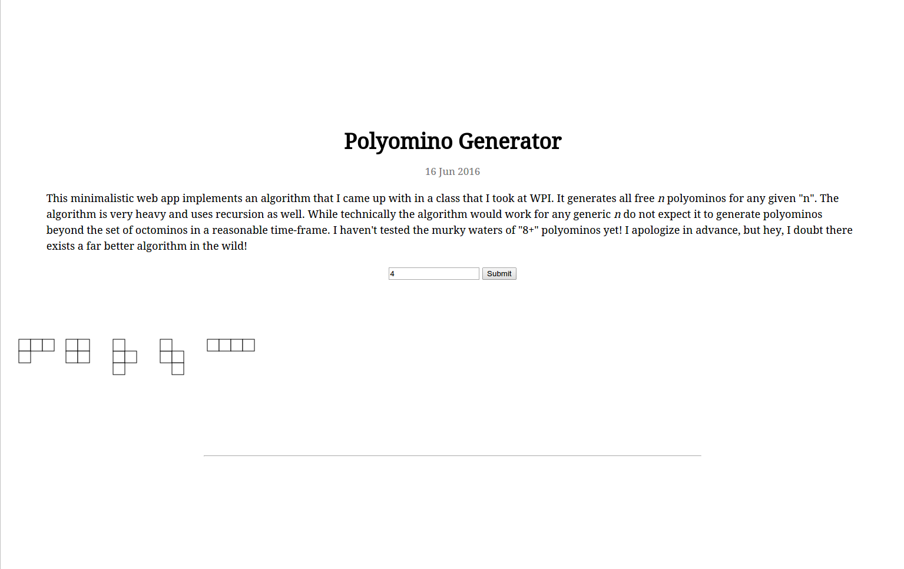
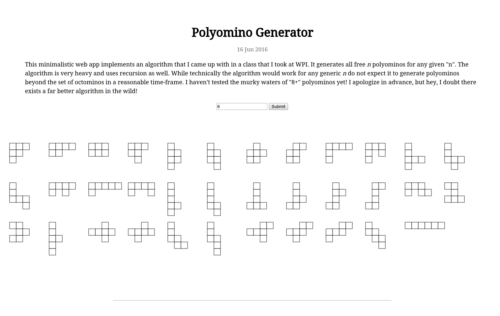

# Polyomino Generator
A minimalistic web application that implements a polyomino generating algorithm using d3 and SVG elements to render shapes on the screen. A working example is available to check out <a href = "https://htmlpreview.github.io/?https://github.com/Jenna3715/polyominogenerator/blob/master/index.html">here</a>. Stay tuned for a link to the blog post that analyzes the extremely <b>slow</b> algorithm that powers the app. 

## Screenshots of the Working Example
This is the list of quadrominos that are generated when 4 is entered as an input.

This is the list of hexominos that are generated when 6 is entered as an input.

For a detailed time-efficiency analysis of the algorithm go <a href = "http://kartikvasu.github.io/blog/2016/06/23/polyominogen-analysis">here</a>.
